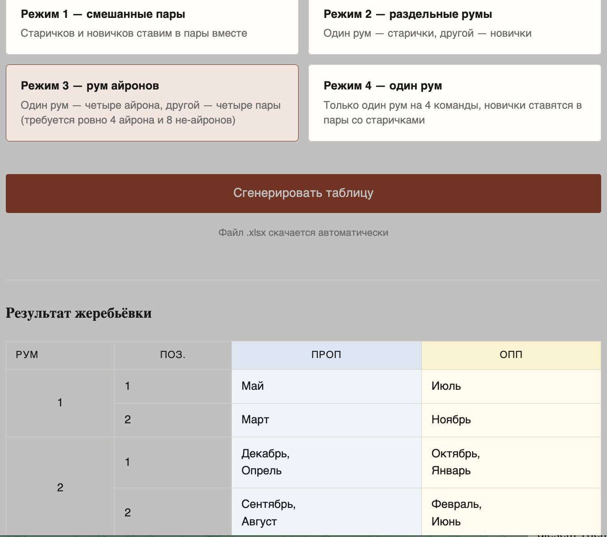

Скрипт для простого создания **сетки для дебатов** британского парламентского формата

## Браузерная версия

  

Подробнее об использовании читайте ниже, начиная с Использование п. 2. 

- Обработка всех данных происходит на клиентской стороне с использованием pyodide (соответственно, Python), без проприетарных скриптов или обращения к любым серверам. Для работы программы в браузере нужна работа JavaScript. 
- Без скриптов можно использовать CLI-версию (см. Установка)
- Автоматически всем присваивается категория "Старичок", это можно (и нужно!) изменить для новичков, но, так как их обычно меньше, дефолтный параметр это старые игроки.
- Также доступен вводи участников через параметр запроса к URL `?names=`, с разделением через запятую
  - Например, для двух участников, Января Зимниевича и Августа Летниевича, запрос может быть подан в форме `https://cyphershark.github.io/bpd-arrangement/?names=Январь Зимниевич,Август Летниевич`

    У первых двух участников окажутся заполненными поля имён как Январь Зимниевич и Август Летниевич
  - Запрос может содержать до 15 запятых, то есть, до 16 участников

## Установка
Если вам нравится запуск скриптов, то вам сюда.
1. **Ставим Python.**

Откройте терминал и введите:
- MacOS: `brew install python`
- Linux: `sudo apt install python3 python3-pip` (замените apt на dnf или pacman в зависимости от вашей системы)
- Windows: [сделайте всё сами](https://www.python.org/downloads/windows/)

2. **Ставим openpyxl.**
- Linux/MacOS: `python3 -m pip install openpyxl`
- Windows: `python -m pip install openpyxl`

3. **Получаем скрипт.**
`curl -O https://raw.githubusercontent.com/cyphershark/bpd-arrangement/main/bpd.py`

## Использование
0. **Запускаем скрипт.**
   - Linux/MacOS: `python -m bpd.cli`
   - Windows: `python -m bpd.cli` (не проверялось)

1. Следуя по инструкциям, **вводим последовательно имена участников-дебатёров** (<= 16). Когда участники закончились, вписываем `done`
2. Появится пронумерованный список участников. Вписываем **номера участников-айронов**. **Внимание!** Количество айронов может быть только (16-n), где n - количество зарегистрированных участников. Иначе дебаты не получатся, ведь будут пустые позиции.
   Формат вписывания айронов:
   1. Перечисление: `1,2,6`
   2. Последовательные позиции: `1-3`, что эквивалентно `1,2,3`
3. Выбираем **стиль расстановки** участников:
   1. `1` - если хотите, чтобы "новички" были в парах со "старичками"
   2. `2` - если хотите, чтобы "новички" были только с "новичками" в одном руме, а "старички" - со "старичками" в другом руме.
   3. `3` - режим две комнаты, в одной айроны, в другой пары.
   4. `4` - режим одной комнаты.

**Обратите внимание**, что при неравенстве старичков и новичков программа сделает случайное распределение по остаточному принципу, таким образом, завершив работу. Новички во второй очереди. 

4. Далее для каждого участника программа предложит **выбрать, новичок ли он** (n - да, o - нет), а также, если участник помечен как айрон, **будет ли он на открывающей позиции** (1 ПРОП/1 ОПП; 0 - нет, 1 - да).

5. Наконец, программа предложит **проверить введённых участников** и:
   1. Ввести `y` - если вы хотите создать сетку
   2. Ввести `n` - если вы **не** хотите создать сетку
6. Если всё успешно, **сетка будет создана в файле под названием "bp_draw.xlsx"**. Сама сетка будет находится на листе draw.

## Потенциальные улучшения
- Возможность выбора количества румов (например, от 1 до 5)
- ~~Больше модов расстановки~~ добавлены режимы для 1 айрон-рума и онли 1 рума
- Расстановка судей
